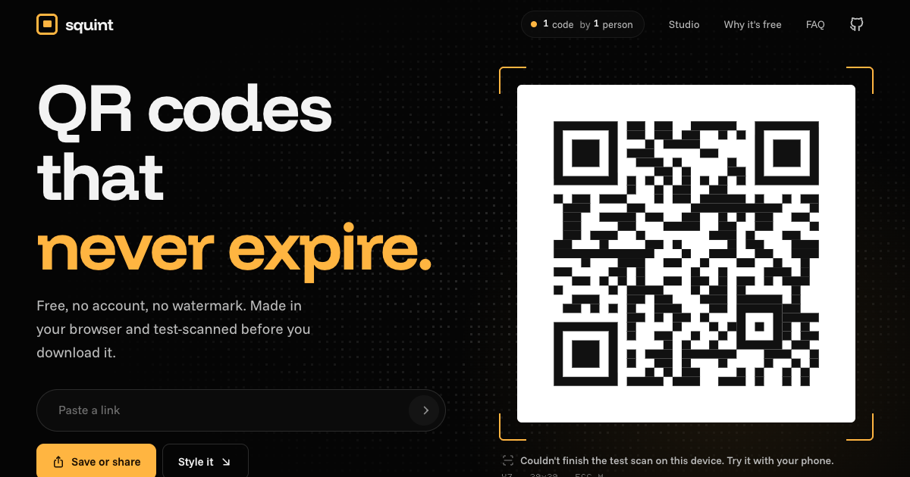

# squint

Free QR codes that never expire. No account, no watermark, no trial.

**Live:** https://vjadh07.github.io/squint/



## why i made this

Most "free" QR sites give you a code that points at their server first, then switch it off when your trial ends. Squint makes static codes, so your link is stored in the pattern itself. Nothing in the middle can break it or track it. Everything happens in your browser, and every code gets test-scanned before you download it.

## what it does

- Links, text, Wi-Fi logins, email, phone, SMS and contact cards
- Dot styles (square, blob, dots, bars), corner styles and presets
- Your own colors, a logo in the middle, a "scan me" sticker frame, transparent background
- Reads your code back with a QR decoder after every change, so you know it scans
- PNG (512 to 2048 px), SVG, copy, or the share sheet on phones
- A live counter of how many codes have been made. The only thing sent is a +1, never what's inside your code.

## running it

```bash
npm install
npm run dev      # http://localhost:5180/squint/
npm test         # unit tests
npm run build    # production build in dist/
```

Pushing to `main` runs the tests, builds, and deploys to GitHub Pages.

## how it's built

React + Vite + Tailwind, with motion for animation.

- `src/lib/payload.ts` turns form fields into the text inside the code (Wi-Fi and vCard need escaping)
- `src/lib/scene.ts` turns the QR matrix into shapes. The canvas preview and the SVG/PNG export both draw from the same scene, so the preview is exactly what you download
- `src/lib/scan.ts` test-scans the code in a web worker using jsQR
- `src/lib/counter.ts` is the live counter (Abacus, a free counting API)

Some UI pieces started from Aceternity UI, Magic UI and Motion Primitives and were adapted for this site. QR encoding is [qrcode-generator](https://github.com/kazuhikoarase/qrcode-generator).

QR Code is a registered trademark of DENSO WAVE.

## license

MIT. Do whatever you want with it.
